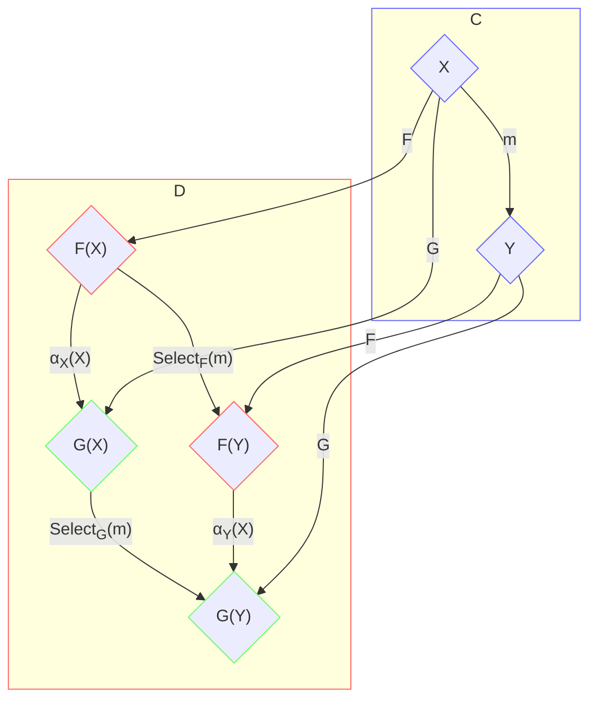
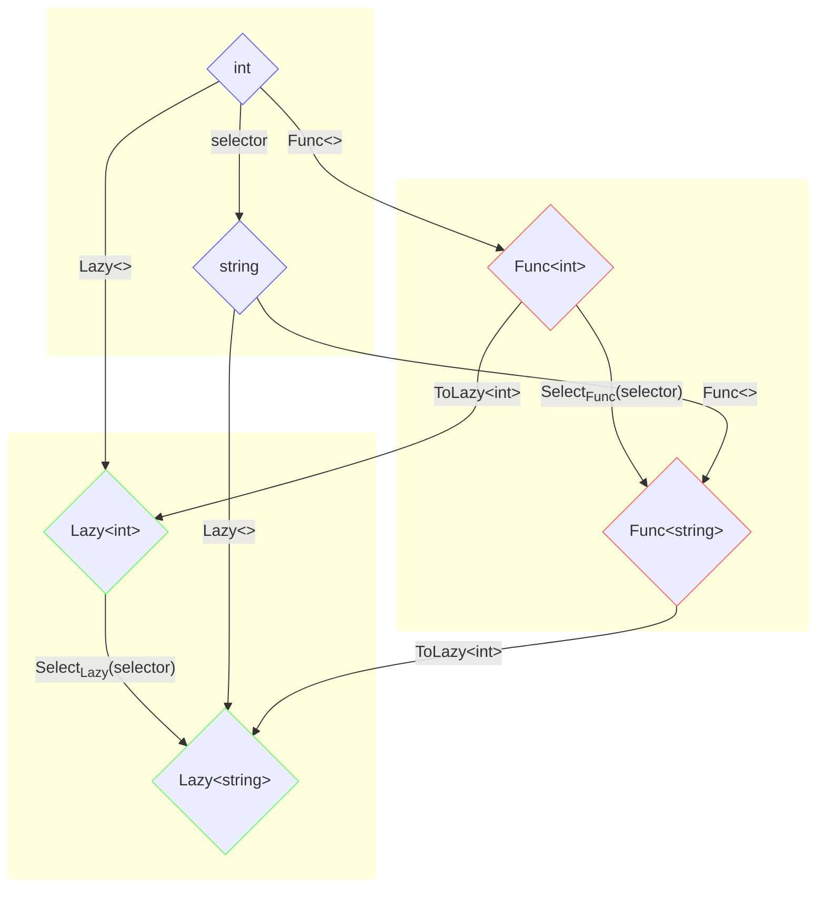
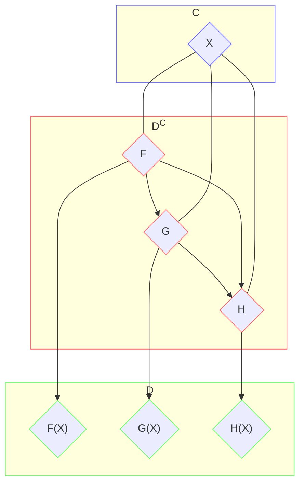
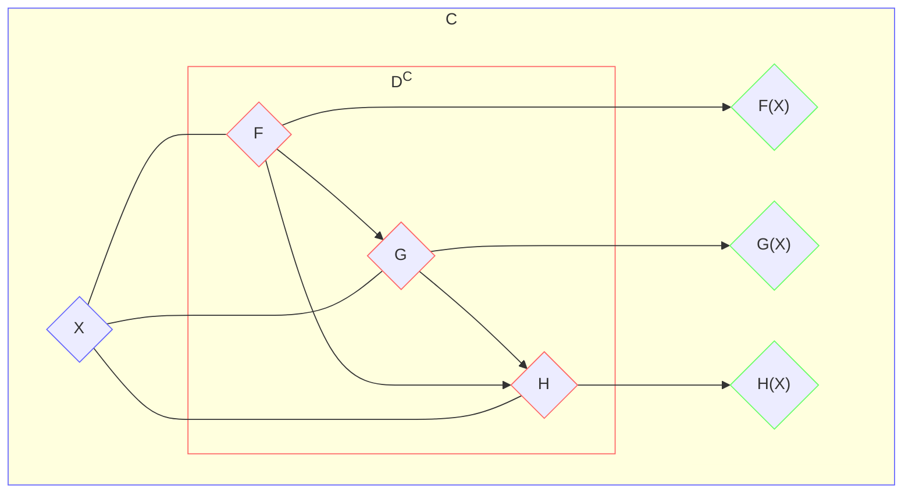

> [!TIP]
> [Functional Programming and LINQ via C#](/posts/linq-via-csharp) Series
>
> [Category Theory via C#](/archive/?tag=Category%20Theory) Series

## Natural transformation and naturality

If F: C → D and G: C → D are both functors from categories C to category D, the mapping from F to G is called [natural transformation](http://en.wikipedia.org/wiki/Natural_transformation) and denoted α: F ⇒ G. α: F ⇒ G is actually family of morphisms from F to G, For each object X in category C, there is a specific morphism αX: F(X) → G(X) in category D, called the component of α at X. For each morphism m: X → Y in category C and 2 functors F: C → D, G: C → D, there is a naturality square in D:

[](https://aspblogs.z22.web.core.windows.net/dixin/Windows-Live-Writer/public-static-partial-class-Optio.------_E2EC/image_2.png)



In another word, for m: X → Y in category C, there must be αY ∘ F(m) ≡ G(m) ∘ αX , or equivalently αY ∘ SelectF(m) ≡ SelectG(m) ∘ αX in category D.

In DotNet category, the following ToLazy<> generic method transforms Func<> functor to Lazy<> functor:

```csharp
public static partial class NaturalTransformations
{
    // ToLazy: Func<> -> Lazy<>
    public static Lazy<T> ToLazy<T>(this Func<T> function) => new Lazy<T>(function);
}
```

Apparently, for above natural transformation: ToLazy<>: Func<> ⇒ Lazy<>:

-   for each specific object T, there is an object `Func<T>`, an object `Lazy<T>`, and a morphism `ToFunc<T>: Func<T> → Lazy<T>`.
-   For each specific morphism selector: TSource → TResult, there is a naturality square, which consists of 4 morphisms:

-   `ToLazy<TResult>: Func<TResult> → Lazy<TResult>`, which is the component of ToLazy<> at TResult
-   `FuncExtensions.Select(selector): Func<TSource> → Func<TResult>`
-   `LazyExtensions.Select(selector): Lazy<TSource> → Lazy<TResult>`
-   `ToLazy<TSource>: Func<TSource> → Lazy<TSource>`, which is the component of ToLazy<> at TSource




The following example is a simple naturality square that commutes for ToLazy<>:

```csharp
internal static void Naturality()
{
    Func<int, string> selector = int32 => Math.Sqrt(int32).ToString("0.00");

    // Naturality square:
    // ToFunc<string>.o(LazyExtensions.Select(selector)) == FuncExtensions.Select(selector).o(ToFunc<int>)
    Func<Func<string>, Lazy<string>> funcStringToLazyString = ToLazy<string>;
    Func<Func<int>, Func<string>> funcInt32ToFuncString = FuncExtensions.Select(selector);
    Func<Func<int>, Lazy<string>> leftComposition = funcStringToLazyString.o(funcInt32ToFuncString);
    Func<Lazy<int>, Lazy<string>> lazyInt32ToLazyString = LazyExtensions.Select(selector);
    Func<Func<int>, Lazy<int>> funcInt32ToLazyInt32 = ToLazy<int>;
    Func<Func<int>, Lazy<string>> rightComposition = lazyInt32ToLazyString.o(funcInt32ToLazyInt32);

    Func<int> funcInt32 = () => 2;
    Lazy<string> lazyString = leftComposition(funcInt32);
    lazyString.Value.WriteLine(); // 1.41
    lazyString = rightComposition(funcInt32);
    lazyString.Value.WriteLine(); // 1.41
}
```

And the following are a few more examples of natural transformations:

```csharp
// ToFunc: Lazy<T> -> Func<T>
public static Func<T> ToFunc<T>(this Lazy<T> lazy) => () => lazy.Value;

// ToEnumerable: Func<T> -> IEnumerable<T>
public static IEnumerable<T> ToEnumerable<T>(this Func<T> function)
{
    yield return function();
}

// ToEnumerable: Lazy<T> -> IEnumerable<T>
public static IEnumerable<T> ToEnumerable<T>(this Lazy<T> lazy)
{
    yield return lazy.Value;
}
```

## Functor Category

Now there are functors, and mappings between functors, which are natural transformations. Naturally, they lead to category of functors. Given 2 categories C and D, there is a [functor category](http://en.wikipedia.org/wiki/Functor_category), denoted DC:

-   Its objects ob(DC) are the functors from category C to D .
-   Its morphisms hom(DC) are the natural transformations between those functors.
-   The composition of natural transformations α: F ⇒ G and β: G ⇒ H, is natural transformations (β ∘ α): F ⇒ H.
-   The identity natural transformation idF: F ⇒ F maps each functor to itself

[](https://aspblogs.z22.web.core.windows.net/dixin/Windows-Live-Writer/public-static-partial-class-Optio.------_E2EC/image_thumb1_2.png)



Regarding the category laws:

-   Associativity law: As fore mentioned, natural transformation’s components are morphisms in D, so natural transformation composition in DC can be viewed as morphism composition in D: (β ∘ α)X: F(X) → H(X) = (βX: G(X) → H(X)) ∘ (αX: F(X) → G(X)). Natural transformations’ composition in DC is associative, since all component morphisms’ composition in D is associative
-   Identity law: similarly, identity natural transform’s components are the id morphisms idF(X): F(X) → F(X) in D. Identity natural transform satisfy identity law, since all its components satisfy identity law.

Here is an example of natural transformations composition:

```csharp
// ToFunc: Lazy<T> -> Func<T>
public static Func<T> ToFunc<T>(this Lazy<T> lazy) => () => lazy.Value;
#endif

// ToOptional: Func<T> -> Optional<T>
public static Optional<T> ToOptional<T>(this Func<T> function) =>
    new Optional<T>(() => (true, function()));

// ToOptional: Lazy<T> -> Optional<T>
public static Optional<T> ToOptional<T>(this Lazy<T> lazy) =>
    // new Func<Func<T>, Optional<T>>(ToOptional).o(new Func<Lazy<T>, Func<T>>(ToFunc))(lazy);
    lazy.ToFunc().ToOptional();
}
```

### Endofunctor category

Given category C, there is a endofunctors category, denoted CC, or End(C), where the objects are the endofunctors from category C to C itself, and the morphisms are the natural transformations between those endofunctors.




All the functors in C# are endofunctors from DotNet category to DotNet. They are the objects of endofunctor category DotNetDotNet or End(DotNet).
