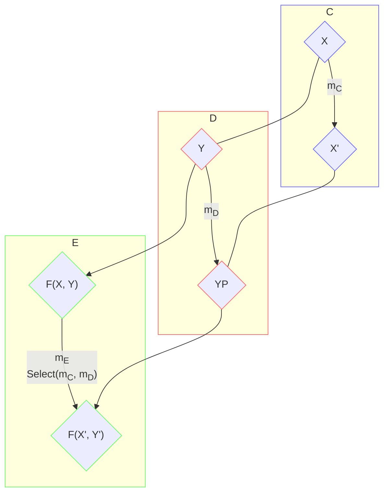
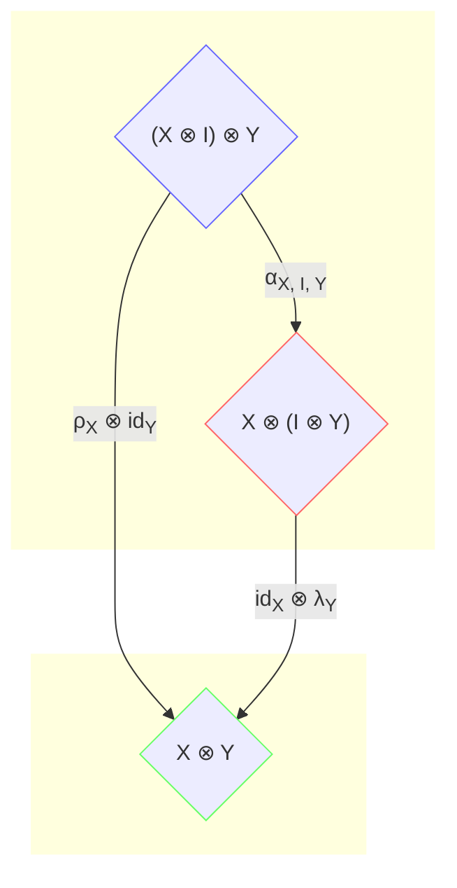
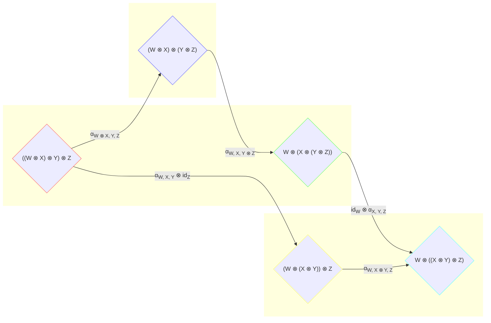

> [!TIP]
> [Functional Programming and LINQ via C#](/posts/linq-via-csharp) Series
>
> [Category Theory via C#](/archive/?tag=Category%20Theory) Series

## Bifunctor

A functor is the mapping from 1 object to another object, with a “Select” ability to map 1 morphism to another morphism. A [bifunctor](http://en.wikipedia.org/wiki/Functor#Bifunctors_and_multifunctors) (binary functor), as the name implies, is the mapping from 2 objects and from 2 morphisms. Giving category C, D and E, bifunctor F from category C, D to E is a structure-preserving morphism from C, D to E, denoted F: C × D → E:

[](https://aspblogs.z22.web.core.windows.net/dixin/Windows-Live-Writer/Category-Theory-via-C-9-Functor-Category_8A55/image1.png)

-   F maps objects X ∈ ob(C), Y ∈ ob(D) to object F(X, Y) ∈ ob(E)
-   F also maps morphisms mC: X → X’ ∈ hom(C), mD: Y → Y’ ∈ hom(D) to morphism mE: F(X, Y) → F(X’, Y’) ∈ hom(E)



In DotNet category, bifunctors are binary endofunctors, and can be defined as:

```csharp
// Cannot be compiled.
public interface IBifunctor<TBifunctor<,>> where TBifunctor<,> : IBifunctor<TBifunctor<,>>
{
    Func<TBifunctor<TSource1, TSource2>, TBifunctor<TResult1, TResult2>> Select<TSource1, TSource2, TResult1, TResult2>(
        Func<TSource1, TResult1> selector1, Func<TSource2, TResult2> selector2);
}
```

The most intuitive built-in bifunctor is ValueTuple<,>. Apparently ValueTuple<,> can be viewed as a type constructor of kind \* –> \* –> \*, which accepts 2 concrete types to and return another concrete type. Its Select implementation is also straightforward:

```csharp
public static partial class ValueTupleExtensions // ValueTuple<T1, T2> : IBifunctor<ValueTuple<,>>
{
    // Bifunctor Select: (TSource1 -> TResult1, TSource2 -> TResult2) -> (ValueTuple<TSource1, TSource2> -> ValueTuple<TResult1, TResult2>).
    public static Func<ValueTuple<TSource1, TSource2>, ValueTuple<TResult1, TResult2>> Select<TSource1, TSource2, TResult1, TResult2>(
        Func<TSource1, TResult1> selector1, Func<TSource2, TResult2> selector2) => source =>
            Select(source, selector1, selector2);

    // LINQ-like Select: (ValueTuple<TSource1, TSource2>, TSource1 -> TResult1, TSource2 -> TResult2) -> ValueTuple<TResult1, TResult2>).
    public static ValueTuple<TResult1, TResult2> Select<TSource1, TSource2, TResult1, TResult2>(
        this ValueTuple<TSource1, TSource2> source,
        Func<TSource1, TResult1> selector1,
        Func<TSource2, TResult2> selector2) =>
            (selector1(source.Item1), selector2(source.Item2));
}
```

However, similar to ValueTuple<> functor’s Select method, ValueTuple<,> bifunctor’s Select method has to call selector1 and selector2 immediately. To implement deferred execution, the following Lazy<,> bifunctor can be defined:

```csharp
public class Lazy<T1, T2>
{
    private readonly Lazy<(T1, T2)> lazy;

    public Lazy(Func<(T1, T2)> factory) => this.lazy = new Lazy<(T1, T2)>(factory);

    public T1 Value1 => this.lazy.Value.Item1;

    public T2 Value2 => this.lazy.Value.Item2;

    public override string ToString() => this.lazy.Value.ToString();
}
```

Lazy<,> is simply the lazy version of ValueTuple<,>. Jut like Lazy<>, Lazy<,> can be constructed with a factory function, so that the call to selector1 and selector2 are deferred:

```csharp
public static partial class LazyExtensions // Lazy<T1, T2> : IBifunctor<Lazy<,>>
{
    // Bifunctor Select: (TSource1 -> TResult1, TSource2 -> TResult2) -> (Lazy<TSource1, TSource2> -> Lazy<TResult1, TResult2>).
    public static Func<Lazy<TSource1, TSource2>, Lazy<TResult1, TResult2>> Select<TSource1, TSource2, TResult1, TResult2>(
        Func<TSource1, TResult1> selector1, Func<TSource2, TResult2> selector2) => source =>
            Select(source, selector1, selector2);

    // LINQ-like Select: (Lazy<TSource1, TSource2>, TSource1 -> TResult1, TSource2 -> TResult2) -> Lazy<TResult1, TResult2>).
    public static Lazy<TResult1, TResult2> Select<TSource1, TSource2, TResult1, TResult2>(
        this Lazy<TSource1, TSource2> source,
        Func<TSource1, TResult1> selector1,
        Func<TSource2, TResult2> selector2) =>
            new Lazy<TResult1, TResult2>(() => (selector1(source.Value1), selector2(source.Value2)));
}
```

## Monoidal category

With the help of bifunctor, [monoidal category](http://en.wikipedia.org/wiki/Monoidal_category) can be defined. A [monoidal category](http://en.wikipedia.org/wiki/Monoidal_category) is a category C equipped with:

-   A bifunctor ⊗ as the monoid binary multiplication operation: bifunctor ⊗ maps 2 objects in C to another object in C, denoted C ⊗ C → C, which is also called the [monoidal product](http://en.wikipedia.org/wiki/Tensor_product) or [tensor product](https://en.wikipedia.org/wiki/Tensor_product).
-   An unit object I ∈ ob(C) as the monoid unit, also called tensor unit

For (C, ⊗, I) to be a monoid, it also needs to be equipped with the following natural transformations, so that the monoid laws are satisfied:

-   Associator αX, Y, Z: (X ⊗ Y) ⊗ Z ⇒ X ⊗ (Y ⊗ Z) for the associativity law, where X, Y, Z ∈ ob(C)
-   Left unitor λX: I ⊗ X ⇒ X for the left unit law, and right unitor ρX: X ⊗ I ⇒ X for the right unit law, where X ∈ ob(C)

The following monoid triangle identity and pentagon identity diagrams still commute for monoidal category:

[](https://aspblogs.z22.web.core.windows.net/dixin/Windows-Live-Writer/Category-Theory-via-C-5-Bifunctor_548F/image_thumb12_thumb_2.png)



[](https://aspblogs.z22.web.core.windows.net/dixin/Windows-Live-Writer/Category-Theory-via-C-5-Bifunctor_548F/Untitled-2.fw_thumb_thumb_2.png)



Here for monoidal category, the above ⊙ (general multiplication operator) becomes ⊗ (bifunctor).

Monoidal category can be simply defined as:

```csharp
public interface IMonoidalCategory<TObject, TMorphism> : ICategory<TObject, TMorphism>, IMonoid<TObject> { }
```

DotNet category is monoidal category, with the most intuitive bifunctor ValueTuple<,> as the monoid multiplication, and Unit type as the monoid unit:

```csharp
public partial class DotNetCategory : IMonoidalCategory<Type, Delegate>
{
    public static Type Multiply(Type value1, Type value2) => typeof(ValueTuple<,>).MakeGenericType(value1, value2);

    public static Type Unit => typeof(Unit);
}
```

To have (DotNet, ValueTuple<,>, Unit) satisfy the monoid laws, the associator, left unitor and right unitor are easy to implement:

```csharp
public partial class DotNetCategory
{
    // Associator: (T1 x T2) x T3 -> T1 x (T2 x T3)
    // Associator: ValueTuple<ValueTuple<T1, T2>, T3> -> ValueTuple<T1, ValueTuple<T2, T3>>
    public static (T1, (T2, T3)) Associator<T1, T2, T3>(((T1, T2), T3) product) =>
        (product.Item1.Item1, (product.Item1.Item2, product.Item2));

    // LeftUnitor: Unit x T -> T
    // LeftUnitor: ValueTuple<Unit, T> -> T
    public static T LeftUnitor<T>((Unit, T) product) => product.Item2;

    // RightUnitor: T x Unit -> T
    // RightUnitor: ValueTuple<T, Unit> -> T
    public static T RightUnitor<T>((T, Unit) product) => product.Item1;
}
```
